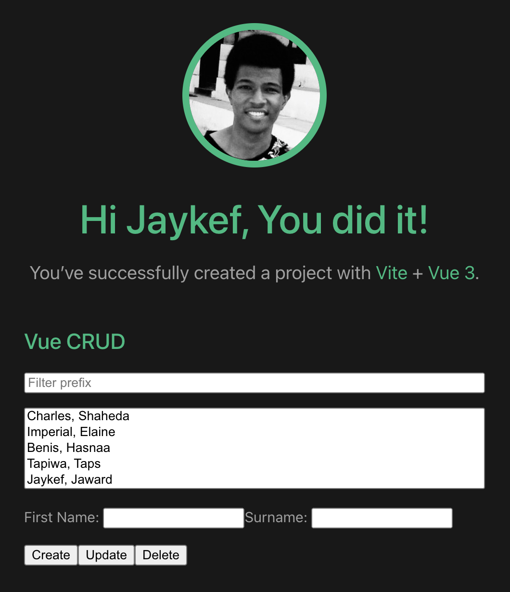

# Intro-to-Vue
This repo contains source codes and slides for a programming tutorial session I weekly hold at my school (Beijing Institute of Technology)

## Apps

### 1. Vue CRUD App (using vue cli tools)

### 2. Vue MyProfile App (using vue cdn)

